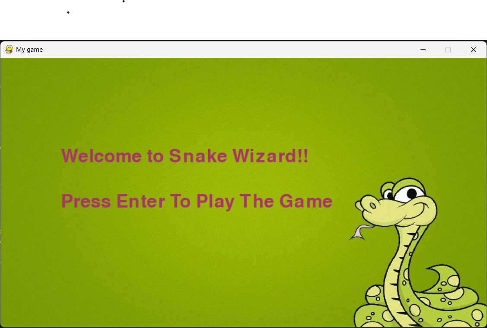
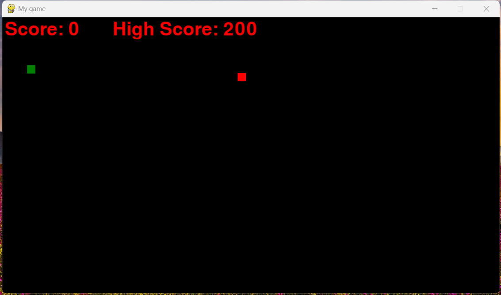

# 🐍 Snake Game

A simple **Snake Game** built using [Pygame](w). The goal is to control the snake, eat food to grow, and avoid colliding with the walls or itself.

## 🚀 Features
- **Classic Snake Mechanics** – Move, eat food, and grow in size.
- **Score Tracking** – Your score increases as the snake eats food.
- **Game Over Condition** – The game ends if the snake collides with itself or the boundaries.
- **Smooth Animations** – Real-time movement using Pygame.

## 🛠 Requirements
Make sure you have the following installed before running the game:

- **Python 3.x** ([Download Here](https://www.python.org/downloads/))
- **Pygame**

To install Pygame, run:
```sh
pip install pygame
```

## 🎮 Controls
- **Arrow Keys (⬆️⬇️⬅️➡️)** – Move the snake.

## 🚀 How to Play
1. Run the game script:
   ```sh
   python snake.py
   ```
2. Use arrow keys to move the snake.
3. Eat food to grow and increase your score.
4. Avoid hitting the walls or your own body.
5. The game ends when you collide with yourself or the walls.

## 📷 Screenshot




## 📜 License
This project is open-source and free to use. Feel free to modify and improve it!

---
Enjoy the game! 🎉🐍

